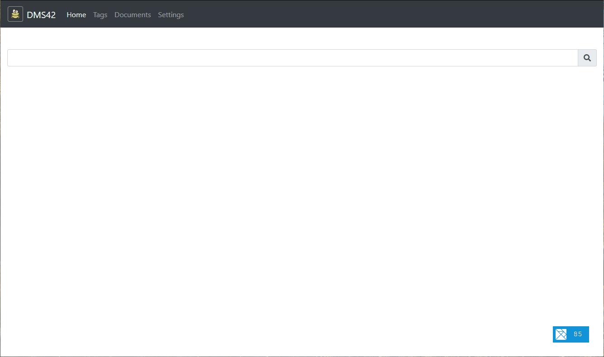

# Dms42

If you just need to save your files, add some tags to classify your documents and search for them on your tablet, this small app should be enough for you.  



# Why?

I really like the functional approach and I need a project to learn something then I created this small DMS.

# Technologies

[Elixir](https://elixir-lang.org/) for the backend, [ELM](https://elm-lang.org/) for the frontend, the filesystem as documents storage and [PostgreSQL](https://www.postgresql.org/) as configuration storage.

# How to run it?

I bundled the application with [Docker](https://www.docker.com/), you just have to configure the **DB_** environment variables, set the path of the documents and its thumbnails and it's done !

```
version: '3'

services:
    dms42:
        image: minidfx/dms42:alpha
        ports:
            - 80:4001
        environment:
            - DB_USER=<user>
            - DB_PASS=<password>
            - DB_HOST=<host>>
            - DB_NAME=<db-name>
            - PUID=1000
            - GUID=100
            - STOP_WORDS=au aux ce avec ces dans de des du elle en et eux il je la le leur lui ma mais me meme mes moi mon ne nos notre nous on ou par pas pour qu que qui sa se ses son sur ta te tes toi ton tu un une vos votre vous
        volumes:
            - <document-path>:/app/documents
            - <thumbnails-path>:/app/thumbnails
```

# How to test it?

Use the following [docker-compose-test.yml](https://github.com/minidfx/dms42/blob/master/docker-compose-test.yml) file to run a transient DMS42, DON'T USE IT in your personal production environment.

```
version: '3'

services:
    db:
        image: postgres:11.11
        restart: unless-stopped
        environment:
          - POSTGRES_PASSWORD=my-suPer-pa$$word
    dms42:
        image: minidfx/dms42:alpha
        depends_on:
            - db
        ports:
            - "0.0.0.0:4001:4001/tcp"
        environment:
            - DB_USER=postgres
            - DB_PASS=my-suPer-pa$$word
            - DB_HOST=db
            - DB_NAME=dms42-transient
            - PUID=1000
            - GUID=100
            - STOP_WORDS=au aux ce avec ces dans de des du elle en et eux il je la le leur lui ma mais me meme mes moi mon ne nos notre nous on ou par pas pour qu que qui sa se ses son sur ta te tes toi ton tu un une vos votre vous
```